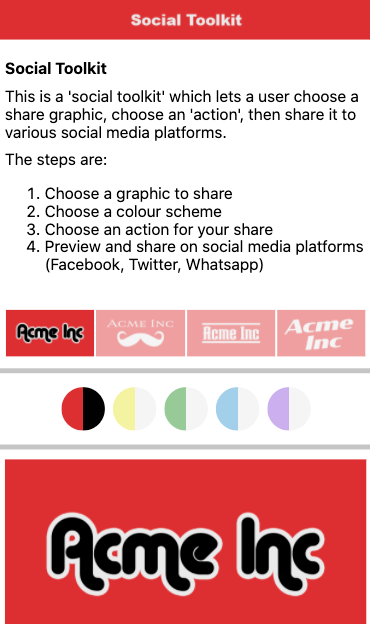
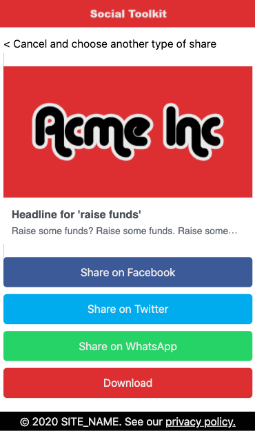
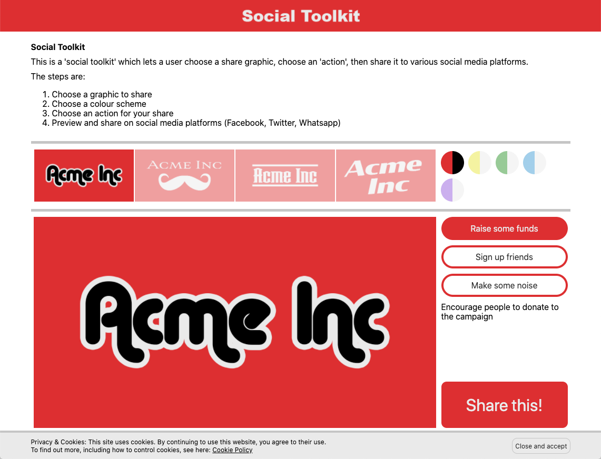
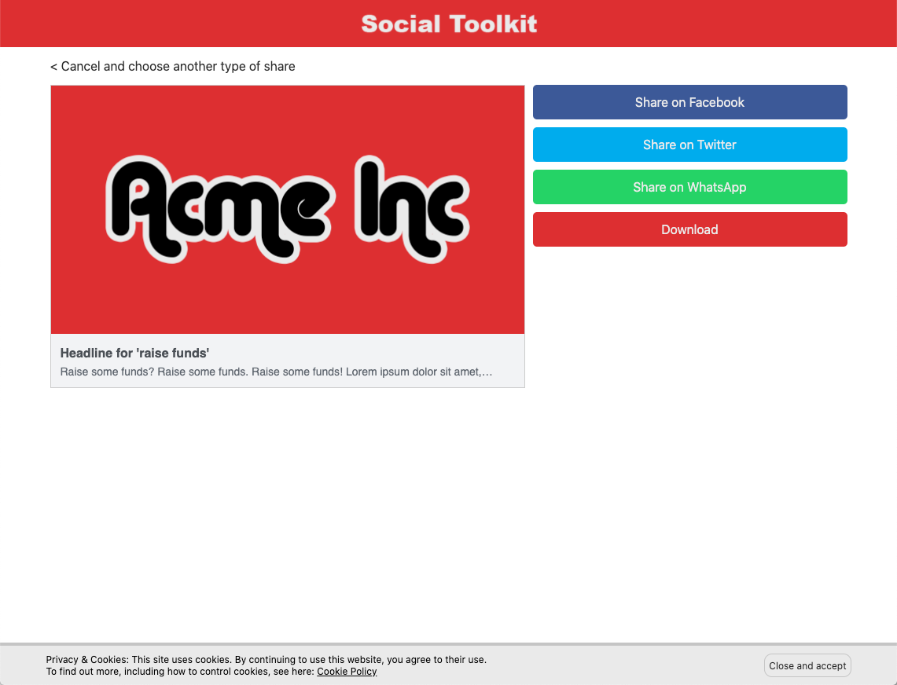

# Acme Social Toolkit

A 'social media toolkit' that lets a user 'build' a 'share' for social media platforms.

Choose an image, choose an action, and then share to Facebook, Twitter or Whatsapp.

- [Non-technical requirements](docs/01.Non-technical_requirements.md)
- [Technical requirements](docs/02.Technical_requirements.md)
- [Information for Campaign Managers and Designers](docs/03.Information_for_Campaign_Managers_and_Designers.md)
- [Information for Developers](docs/04.Information_for_Developers.md)
- [Installation and running locally](docs/05.Installation_and_running_locally.md)
- [Installation and running on the web](docs/06.Installation_and_running_on_the_web.md)

-----

##### Mobile layout

-----

-----

##### Desktop layout

-----

